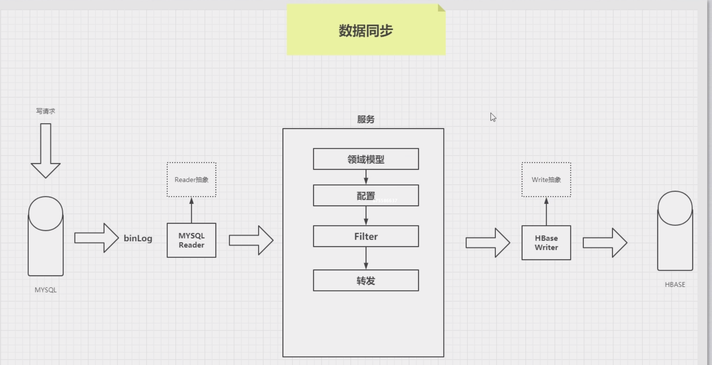

第一期课程大纲：				http://note.youdao.com/noteshare?id=e206d00706b9ee7c2f547c1093b783e4
Spring课程体系：				https://www.processon.com/view/link/5ee057d45653bb29258da558
ApplicationContext继承体系：			https://www.processon.com/view/link/5edf47ffe401fd1fd2832495
BeanFactory继承体系：			https://www.processon.com/view/link/5edf4f9d07912929cb353b20
Spring IOC 容器架构图：			https://www.processon.com/view/link/5ee18fa4e401fd1fd287bee3
架构解耦案例：				https://www.processon.com/view/link/5ee4b833e0b34d4dba38d95b
什么是循环依赖？ 				https://www.processon.com/view/link/5ee6f0f3e0b34d4dba3b5cc2
Spring如何检测出循环依赖？			https://www.processon.com/view/link/5ee6d0edf346fb1ae56223aa
Spring 单例 setter 解决循环依赖：		https://www.processon.com/view/link/5ee6e6c2e0b34d4dba3b3197
# spring 学习
## 数据同步
> 解耦 以及 带来的好处

## spring 如何解耦的
> IOC: inversion of control 控制反转 || Dependency inject 依赖注入

- BeanDefinitionReader
- BeanDefinition
- BeanFactoryPostProcessor

